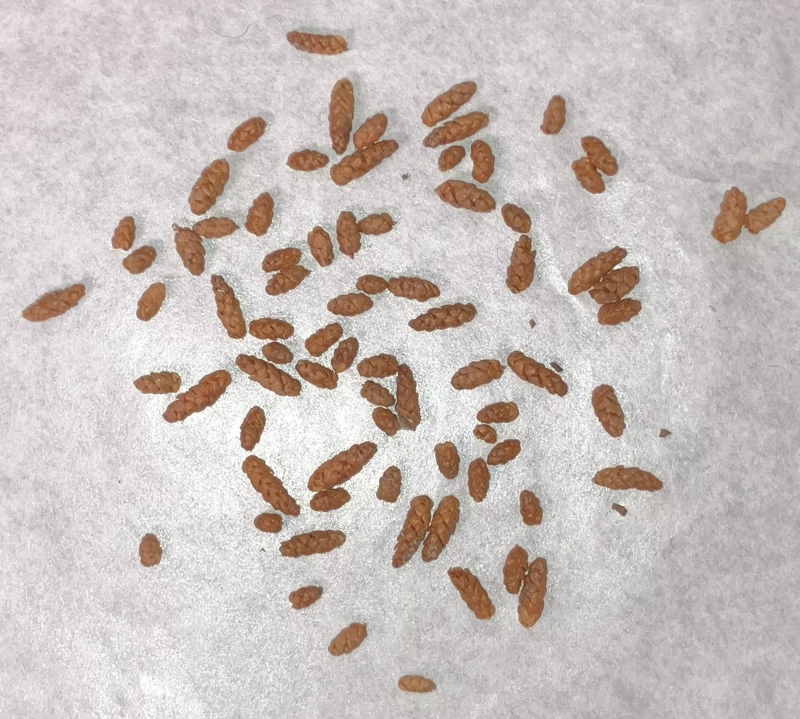
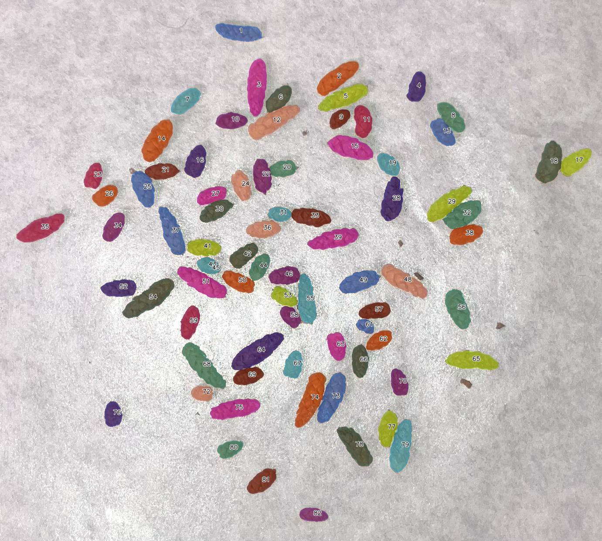

# SAM Particle Counter

[英語版READMEはこちら / English README](README.md)

<p align="center">
  
  
</p>

<p align="center">
  Left: original / Right: final overlay
</p>

SAM Particle Counter は、[SAM2](https://ai.meta.com/research/sam2/) を用いたセグメンテーションと [napari](https://napari.org/stable/) ベースの可視化により、画像データから粒をカウントするデスクトップアプリケーションです。

[オンラインマニュアルはこちらからご覧ください。](https://maple60.github.io/sam-particle-counter/)

## 前提条件

セットアップ前に、以下の要件を確認してください。

- **Python**: `>=3.11.6`（`pyproject.toml` で定義）
- **必須ツール**: 依存関係および仮想環境管理に [`uv`](https://docs.astral.sh/uv/) を使用
- **GPU/CUDA**:
  - GPU は**任意**です。CPU でも動作しますが、パフォーマンスが低下する場合があります。
  - GPU アクセラレーションを利用する場合は、[CUDA](https://developer.nvidia.com/cuda/toolkit) 対応の NVIDIA GPU を使用し、環境に合った CUDA 対応版 [PyTorch](https://pytorch.org/) をインストールしてください。
  - セットアップ実行前に、OS/ドライバと PyTorch の CUDA 互換性を確認してください。
- **OS に関する注意**:
  - **Windows**: 下記の PowerShell コマンドを使用し、`.bat` セットアップスクリプトを実行してください。
  - **macOS**: 下記のシェルコマンドを使用し、`.sh` セットアップスクリプトを実行してください。
  - **Linux**: 下記のシェルコマンドを使用し、`.sh` セットアップスクリプトを実行してください。

## はじめに

### リポジトリを準備

リポジトリをクローンし、仮想環境をセットアップして依存関係をインストールします。

```bash
uv sync
```

デフォルトの `uv sync` では `torch` は PyPI から解決されます。
プラットフォームによっては（例: Linux x86_64）PyPI ホイールがすでに CUDA ランタイム依存を含む場合があり、別の環境では CPU 専用ビルドになることもあります。

まず現在のビルドを確認し、必要な場合のみ CPU/CUDA のインデックスを指定して切り替えてください（下記例）。

#### PyTorch ビルドの切り替え（CPU / CUDA）

同じプロジェクト環境のまま、PC に合わせて PyTorch ビルドを切り替えできます。

- 現在のビルド確認:

```bash
uv run python -c "import torch; print('torch=', torch.__version__, 'cuda=', torch.version.cuda, 'available=', torch.cuda.is_available())"
```

- CPU ビルドを明示して再インストール:

```bash
uv pip install --upgrade --index-url https://download.pytorch.org/whl/cpu torch torchvision torchaudio
```

- CUDA 12.1 ビルドを再インストール（例）:

```bash
uv pip install --upgrade --index-url https://download.pytorch.org/whl/cu121 torch torchvision torchaudio
```

> 注意1: `--upgrade` は同じ `uv` 環境内の既存 `torch*` パッケージを置き換えるため、`uv sync` の後に実行しても有効です。
>
> 注意2: `nvidia-smi` の `CUDA Version: ...` でドライバがサポートする CUDA ランタイムを確認し、互換な PyTorch CUDA ホイール（例: `cu121`）を選んでください。

OSやCUDAのバージョンに応じたPytorchのインストールコマンドは[こちら](https://pytorch.org/get-started/locally/)からご確認いただけます。
`pip3`となっている部分は`uv pip`に置き換えてください。

### SAM2 のセットアップ

Segment Anything Model2（SAM2）をセットアップします。

### Windows

```powershell
setup\setup_sam2.bat
```

### macOS/Linux

```bash
./setup/setup_sam2.sh
```

### アプリケーション起動

```powershell
uv run main.py
```

## クイックスタート手順

[napari](https://napari.org/stable/) 上で粒子カウントを行うための標準的な操作フローです。記載は `main.py` の UI ボタン名に合わせてあるため、README の手順をそのまま UI に対応付けできます。

1. **画像を読み込む**  
   [napari](https://napari.org/stable/) で画像を開きます（ドラッグ＆ドロップ、または `File > Open...`）。最初の画像が追加されると、対応する ROI レイヤー（`<image_name>_ROI`）が自動で作成されます。
2. **ROI レイヤーを作成/選択し、矩形を描画**  
   `*_ROI` レイヤーを選択し、Shapes ツールで矩形 ROI を 1 つ描画します（複数ある場合は、最後に描画した ROI が使用されます）。
3. **Crop を実行**  
   右側ドックの **`Crop to ROI`** を実行して、`<image_name>_cropped` レイヤーを作成します。
4. **SAM2 自動セグメンテーションを実行**  
   `<image_name>_cropped` 画像レイヤーを選択し、右側ドックの **`Run SAM2 auto segmentation`** を実行します。必要に応じて `Output mode` などのパラメータを調整してください。
5. **粒子数を確認してエクスポート**  
   セグメンテーション結果を確認後、右側ドックの **`Export segmentation artifacts`** を実行します。完了メッセージ内の `sam2=...` および `final=...` が粒子数を示します。

## 謝辞

本プロジェクトは多くのオープンソースソフトウェアに大きく支えられています。
特に、[napari](https://napari.org/stable/)、[Segment Anything Model 2 (SAM 2)](https://github.com/facebookresearch/sam2)、[OpenCV](https://opencv.org/)、[NumPy](https://numpy.org/)、[pandas](https://pandas.pydata.org/) の開発者および貢献者の皆様に感謝いたします。

## ライセンス

本プロジェクトは [BSD 3-Clause License](https://opensource.org/license/BSD-3-clause) の下でライセンスされています。
詳細は [LICENSE](LICENSE) を参照してください。
