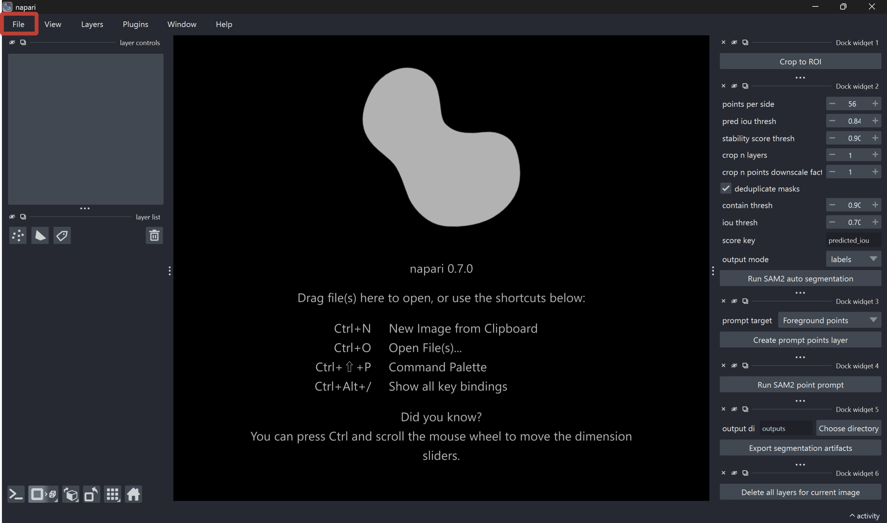
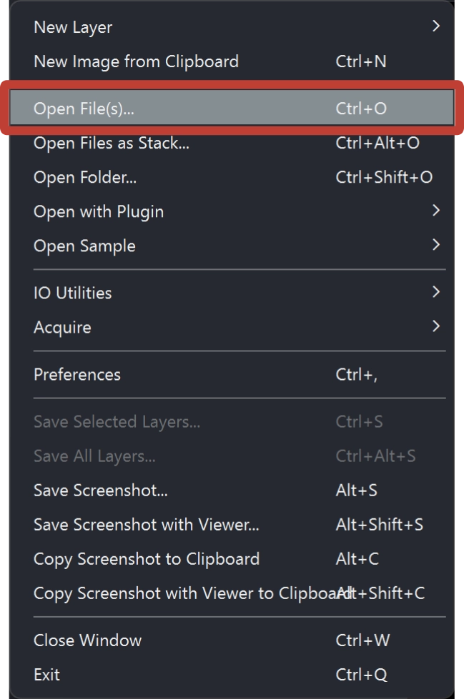
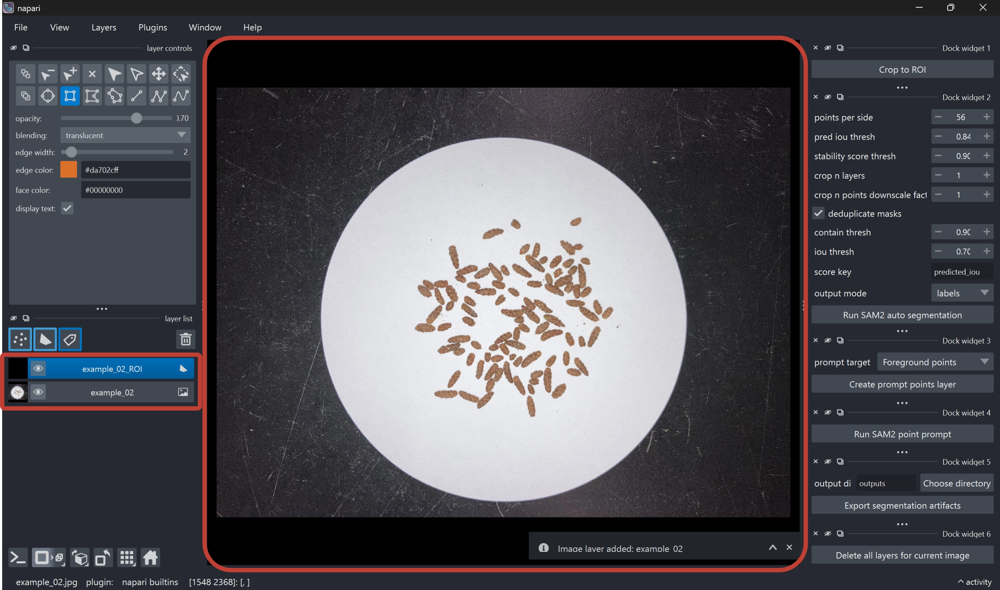
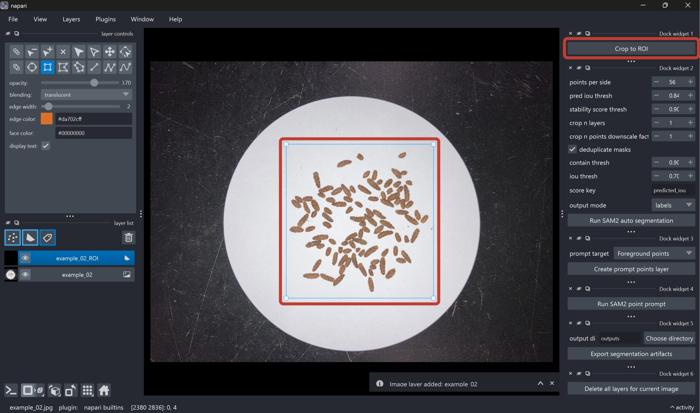
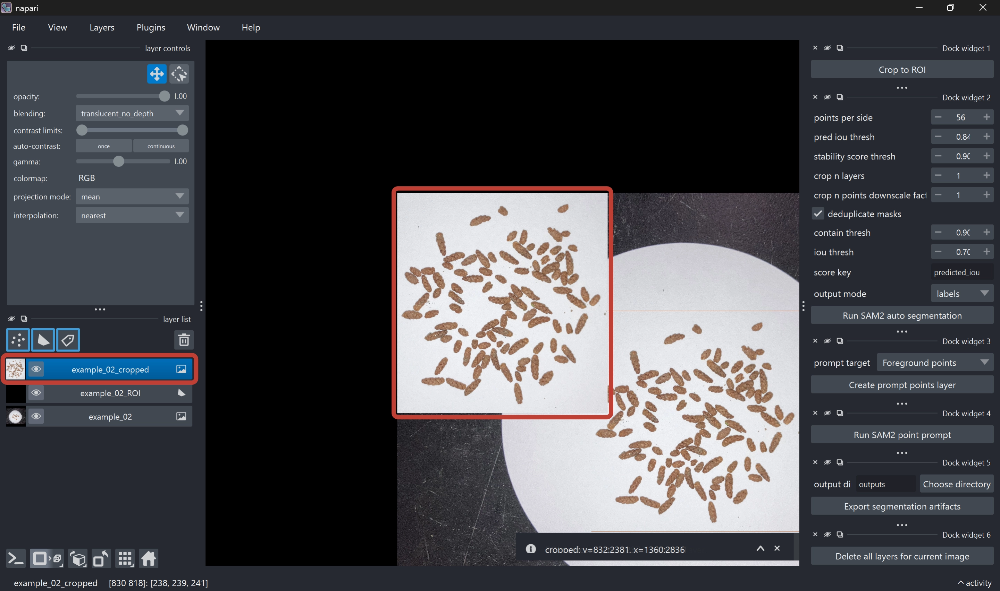
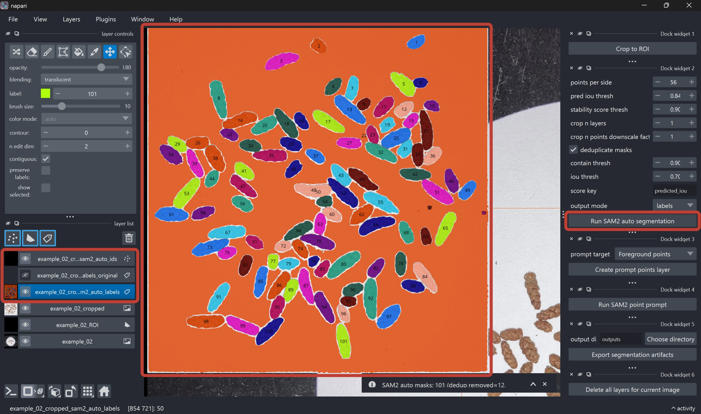
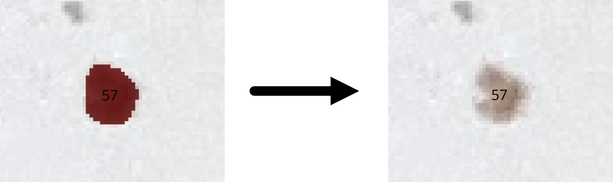
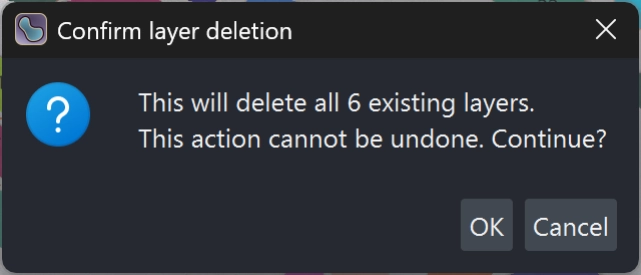

> Japanese version is available here: [SAM Particle Counter マニュアル（日本語版）](manual/index_ja.qmd)

## Introduction

Welcome to the **SAM Particle Counter** manual.

This page is the English manual describing the analysis workflow, from image loading to exporting particle count results.

## What this app can do

SAM Particle Counter is a [napari](https://napari.org/stable/) based desktop tool that supports the following tasks:

- Creating a rectangular ROI (region of interest)
- Automatic segmentation with [SAM2](https://ai.meta.com/research/sam2/)
- Refinement by point prompts and label editing
- Exporting overlay images, CSV files, and run metadata

The typical workflow is as follows:

1. Load an image
2. Draw an ROI
3. Crop to the ROI
4. Run SAM2 auto segmentation
5. Refine the result if needed
6. Export artifacts

## Prerequisites

### Environment setup

For detailed setup instructions, see [`README.md`](https://github.com/maple60/sam-particle-counter).
At minimum, ensure the following:

- Dependencies have been installed with `uv`
- The SAM2 setup script for your OS has been executed
- The app can be started with the following command

```{.bash filename="Terminal"}
uv run main.py
```

::: {.callout-note}
## Recommended input image conditions

To stabilize segmentation quality, the following is recommended:

- Images with sufficient contrast between particles and background
- Images with minimal strong blur or compression noise
:::

## Detailed analysis procedure

### Step 1. Load an image

Load an image into napari (drag and drop, or `File > Open...`).





When the first image layer is added, the corresponding ROI (region of interest) layer (`<image_name>_ROI`) is created automatically.



::: {.callout-caution}
## Do not rename layers

This app resolves processing targets using layer naming conventions.
Please do not manually rename layers.
:::

### Step 2. Draw ROI on the `*_ROI` layer

1. Select the ROI layer (`<image_name>_ROI`) (selected by default)
2. Draw a rectangle with the Add Rectangles tool (selected by default)
3. If multiple ROIs exist, the **last rectangle drawn** is used
4. Run the **Crop to ROI** button in the right-side widget
5. An `<image_name>_cropped` layer is created, and the ROI region is cropped from the source image





::: {.callout-tip}
## Practical tips

- Leave a small margin so target particles are not missed
- Exclude irrelevant regions as much as possible
- If processing is heavy, start from a smaller ROI
- You can pan the view by dragging while holding the space key
:::

### Step 3. Run **Run SAM2 auto segmentation**

1. Select the `<image_name>_cropped` layer (selected by default)
2. Run the **Run SAM2 auto segmentation** button in the right-side widget (adjust parameters as needed)
3. SAM2 segmentation results are output as new layers:
   - `<image_name>_cropped_sam2_auto` (polygons)
   - `<image_name>_cropped_sam2_auto_labels` (editable labels)
   - `<image_name>_cropped_sam2_auto_labels_original` (read-only reference copy)
   - Overlay showing label IDs (do not edit)



#### SAM2 parameters

::: {.list-table}
- - Parameter
  - Description
  - Default (recommended)

- - `points_per_side`
  - Specifies the density of automatic prompt points placed across the image.
    Increasing this value enables finer exploration and improves detection of small particles, but increases processing time and memory usage.
  - **56**

- - `pred iou thresh`
  - Threshold for SAM2’s predicted mask quality score.
    Higher values keep only more confident masks and tend to reduce false positives, but may increase missed detections.
  - **0.84**

- - `stability score thresh`
  - Threshold for mask stability score.
    Higher values keep only masks with more stable boundaries.
    Particles with unstable contours or very small particles may be filtered out.
  - **0.90**

- - `crop n layers`
  - Number of iterative crop-and-reprocess passes.
    Increasing this value can improve local mask detection, but increases processing time.
  - **2**

- - `crop n points downscale factor`
  - Scaling factor for prompt point density within crop regions.
    Higher values reduce point density in crop regions and lighten processing, but may reduce sensitivity for small targets.
  - **1**

- - `deduplicate masks`
  - Enables removal of duplicate masks.
    When enabled, duplicate masks generated for the same particle are removed.
  - **True**

- - `contain thresh`
  - Defines how much one mask must be contained in another to be treated as a duplicate.
    Lower values make duplicate detection less strict and can remove more masks.
    Higher values remove masks only when one is almost fully contained in another.
  - **0.90**

- - `iou thresh`
  - IoU (Intersection over Union) threshold for overlap between two masks.
    Lower values make partially overlapping masks more likely to be removed as duplicates.
    Higher values remove only strongly overlapping masks.
  - **0.70**

- - `score key`
  - Score used to decide which duplicate mask to keep.
    Typically use `predicted_iou` to retain the higher-quality mask.
  - **predicted_iou**

- - `output mode`
  - Specifies the output format for SAM2 results.
    - `labels`: Outputs an editable label layer. Usually recommended.
    - `shapes`: Outputs a polygon layer. Use this if you do not need label painting/editing. Typically not edited.
    - `both`: Outputs both layers.
  - **labels**
:::

### Step 4. Manual refinement (optional)

Refine results as needed to improve final count accuracy.

#### (A) Manual label editing

1. Select the `<image_name>_cropped_sam2_auto_labels` layer (selected by default)
2. Edit labels using napari label editing tools

For basic label editing operations, see the [official napari documentation](https://napari.org/stable/howtos/layers/labels.html#creating-deleting-merging-and-splitting-connected-components).



::: {.callout-tip}
## Tips for manual editing

### When you want to add particles

If particles were missed, increase the label number in the upper-left panel by one, then draw a new particle mask using the paint tool.
You can adjust brush thickness via brush size.

### When you want to split particles

If multiple particles are connected, erase one side with the eraser tool, then increase the label number and repaint a new particle mask.

### When you want to erase a wide area

If background is falsely detected as a mask, click an empty area with the picker tool to select background, then click the background mask with fill tool to erase in bulk.

Similarly, to erase particles in chunks, pick the particle color with the picker tool and then click that particle with fill tool to erase in bulk.

### When you want to remove falsely detected particles

If noise (e.g., dust) is falsely detected as particles, erase it with the eraser tool.

### When you want to inspect mask by mask

Enable show selected to display only the selected label ID mask.
While this is enabled, changing label lets you inspect masks one by one.
:::

#### (B) Point-prompt refinement

1. Run **Create prompt points layer**
2. Select Foreground / Background
3. Place points on the cropped image
4. Run **Run SAM2 point prompt**

Candidate polygons are output to the `*_sam2_points` layer and can be used to guide refinement.

::: {.callout-warning}
## Notes

This feature is currently experimental and may not behave stably in all cases.
It often does not work well for very small particles, so regular manual editing is usually more reliable.
Please note that this feature is likely to change in future updates.
:::

### Step 5. Export results

1. After manual editing is complete, run **Export segmentation artifacts** to export outputs.
   The output directory defaults to `./outputs`, but you can choose any location.
   The output directory is created automatically.
2. When export completes, a timestamped folder such as `example_02_20260426T044227Z` is generated.

The exported folder includes the following files:

::: {.list-table}

- - Filename
  - Description

- - `source_with_roi.png`
  - Source image with ROI box overlay

- - `cropped_image.png`
  - Cropped analysis region image

- - `sam2_only_overlay.png`
  - Overlay image of SAM2 auto segmentation result

- - `final_overlay.png`
  - Overlay image of the final adopted labels

- - `sam2_blobs.csv`
  - Particle mask data based on SAM2 auto segmentation result

- - `final_blobs.csv`
  - Particle mask data based on the final adopted labels

- - `run_metadata.json`
  - JSON file summarizing run parameters, counts, and environment information
:::

### Step 6. Delete layers

After export is complete, run **Delete all layers for current image** to remove all layers related to the current image.
A confirmation dialog appears, so please be careful not to delete by mistake.

Once all layers are deleted, you are ready to load the next image.
Return to Step 1 and load the next image.



## QA checklist

Before accepting final results, check at least the following:

- ROI includes required regions without major over/under coverage
- Mask boundaries are reasonable at representative locations
- Major merge/split errors have been corrected
- Overlay display and CSV row counts are consistent
- `run_metadata.json` is saved together with image artifacts

## Troubleshooting

### Cropped layer is not created

- Confirm the active layer is `*_ROI`
- Confirm a valid rectangular ROI has been drawn

### SAM2 auto segmentation fails

- Recheck SAM2 setup and model placement
- Retry with a smaller ROI
- Retry with a lower `points_per_side`

### Export fails

- Confirm a `*_cropped` layer exists
- Confirm a SAM2 label layer exists
- Confirm write permission for the output directory
